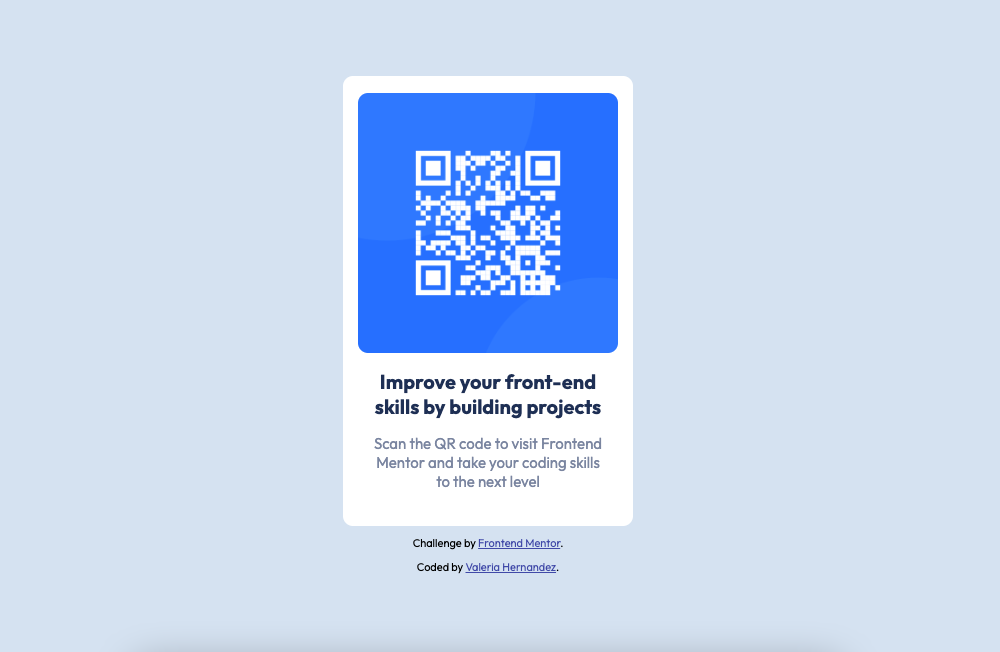

# Frontend Mentor - QR code component solution

This is a solution to the [QR code component challenge on Frontend Mentor](https://www.frontendmentor.io/challenges/qr-code-component-iux_sIO_H). 

## Solution overview

### Links

- Live Site URL: [QR code component](https://valeriahhdez.github.io/frontend_mentor/qr_code/)

## My process

### Built with

- Semantic HTML5 markup
- CSS custom properties
- Flexbox

### What I learned

This is my first Frontend Mentor challenge and also the first time I had to create something from scratch based on a design. 

Some of the things I learned during this challenge are:

1. To think about HTML elements as containers to create hierarchical structure. 
2. To organize my project's files. 
3. To use HTML and CSS comments to make the code more clear, organized, and easy to read. For example, in the following block of code, I've used comments to identify which `
` the closing `
` belongs to. This is going to be useful when writing code with several nested `
` elements.  
   
 ---  
    
        
        
        <h2>Improve your front-end skills by building projects</h2>
        
Scan the QR code to visit Frontend Mentor and take your coding skills to the next level

    
 <!-- / qr-container -->

    

         
 Challenge by <a href="https://www.frontendmentor.io?ref=challenge" target="_blank">Frontend Mentor</a>.

        
 Coded by <a href="https://valeriahhdez.popsy.site/">Valeria Hernandez</a>.

    
 <!-- / attribution -->
---

4. To use margin and padding properties. 
5. To use flexbox to position HTML elements. 

### Continued development

I really enjoyed this challenge, so I am eager to continue my learning path. In this project I learned the basics of flexbox, so my next goal is to become confident in using it. I also want to master CSS grid. 

### Useful resources

- [Kevin Powell's CSS & HTML crash course](https://scrimba.com/learn/introhtmlcss) - This course help me understand how to use HTML elements to create the desired design structure. It also taught me how to use comments and organize better my code and project files. 
- [MDN web docs](https://developer.mozilla.org/en-US/?utm_source=convertkit&utm_medium=email&utm_campaign=My%20go%20to%20resources%20for%20HTML%20&%20CSS%20-%202101392) - I consulted this resource to learn how to use flexbox properties. 

## Author

- Website - [Valeria writes docs](https://valeriahhdez.popsy.site/)
- Frontend Mentor - [@valeriahhdez](https://www.frontendmentor.io/profile/valeriahhdez)
- X - [@valeriahhdez](https://twitter.com/valeriahhdez)
- Dev.To - [Valeria writes docs](https://dev.to/valeriahhdez)